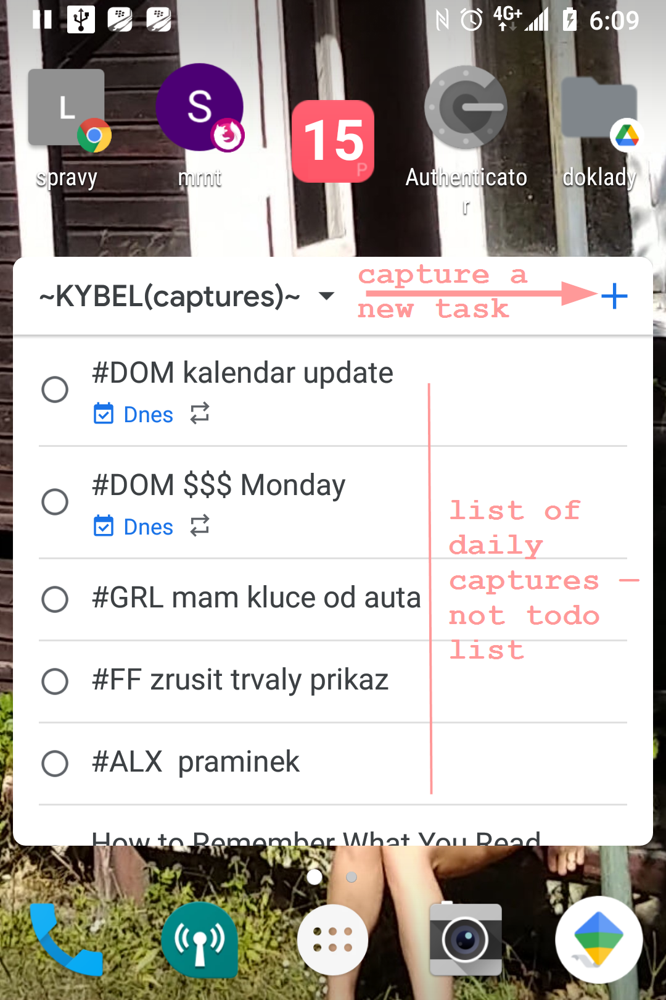
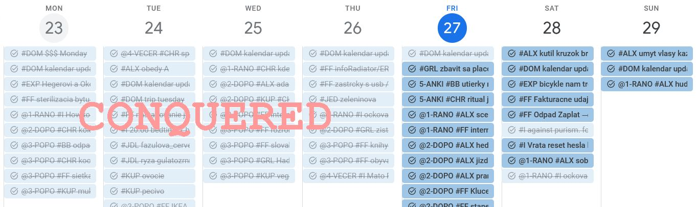
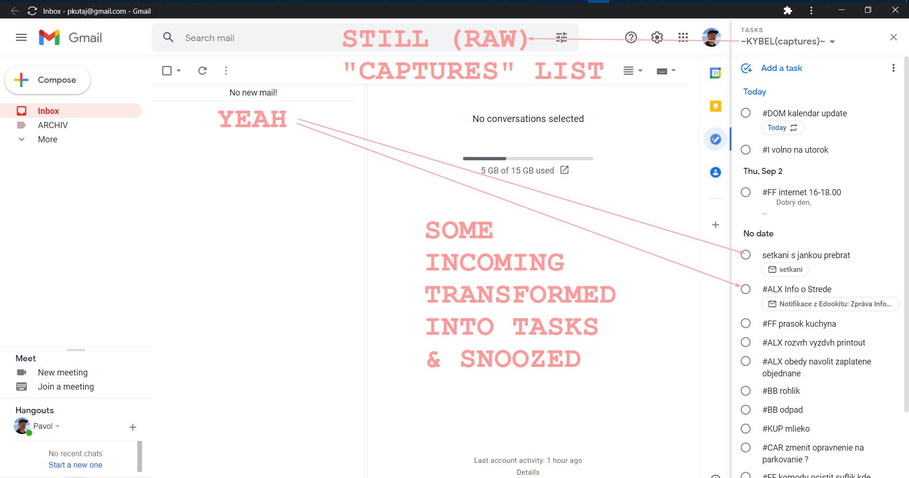
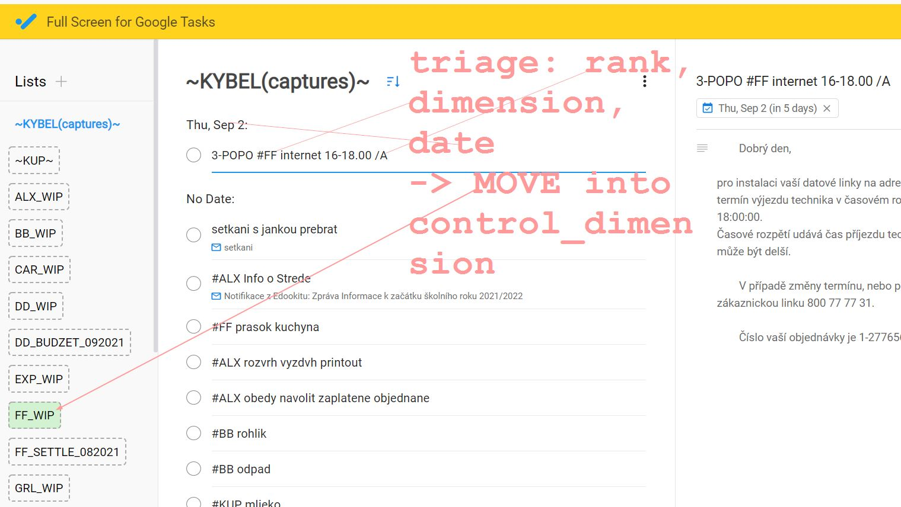

# c3d4

The concern is an ongoing documention of useful planning tactics, dedicated to and based upon [Caw Newport's Core Idea: Time Management](https://www.youtube.com/watch?v=dOQpZlZuySE). The name is the acronym for 

LETTER | MEANING
-------|----------
C      | Capture
C      | Configure
C      | Control
D      | Delete
D      | Delegate
D      | Defer
D      | Do

* Tactical goal is to achieve 4x0 — daily

| COLLECTOR | DIMENSION |
|-----------|-----------|
| capture0  | past0     |
| inbox0    | today0    |

* The theory is created by Cal Newport's C3 Time Management technique

### Ingredients
* [Taskboard - Desktop app for Google Tasks][#1]
* [Full Screen for Google Tasks][#2]
* Gmail
* Google Calendar
* Google Tasks
* Smartphone — ideally Blackberry Key2
* Desktop Computer
* 6$ / months
* 15 minutes block / day  

### 1. BIRME: The Essential Qualities
* [The Qualities of Planning](./assets/The-Qualities-of-Planning.md)
* I dedicate 2x 15-minute rounds with Toggl and block this ~40 minutes daily to the
    - task configuration
    - task control

### 2. Capture
#### 2.1. Tools: Collectors
* tool #1: **Google tasks on Blackberry KEY2** and dedicated Captures bucket on the home screensync
    
* tool #2: [Full Screen for Google Tasks][#2]
* tool #3: **Gmail** 

#### 2.2. Rules
* time: throughout-the-day
* aim: all tasks are captured immediatelly as per GTD

#### 2.3. Instructions
* thorough the day you have the bucket nearby and you captures todos and don't jump into execution
* categorization starts already here by prefixing the task with the category (dimension) shortcut
    - prefixes are organized alphabetically to remember them, to know by heart
    - my list is A-I: #ALX, #BB, #CAR, #DD, #EXP, #FF, #GRL, #HRM, #CHR, #I
    - a smartphone allows to have a shortcut for each of them (type *ee* → `#EXP` + type a capture_item)

### 3. Configure 
#### 3.1. Tools
* tool #1: **Google Calendar**
* tool #2: **Gmail**
* tool #3: [Full Screen for Google Tasks][#2]

#### 3.2. Rules
* time: 15-minutes-morning-ritual
* aim: 3x0: **past0** + **inbox0** + **capture0**

#### 3.3. Instructions
* to get to past0: open Calendar and delete/defer _leftovers_ from yesterday/previous days to present/future
    - of course, you should find nothing in there in the first place
    - but you need to maintain the clean slate

* open Inbox and for emails
    - _either_ release (delete/unsubscribe)
    - _or_ convert into tasks → snooze to make it disappear from the inbox
    - mercilessly unsubscribe from any marketing crap#

* most of the day should already be _explicitly_ present in your calendar as a series *const_blocks*
* reserved blocks correspond with the selected _identity_ 
* step #1: triage them all
    - release/remove as many insignificant captures as possible (KonMari)
    - assign date/prio and move them to _categories_
    - keep quickies for 1D

* **DO** *quickies* (< 120 seconds) NOW; the overhead is more expensive - aka "2 minute rule" (GTD)
* for those to keep, assign
    - rank (priority)
    - cell (category)
    - deadline (date)
    - _no execution, no consumption_

### 4. Control
* You categorize tasks with **Dimensions** — these are the perspectives that make your world, perspective that visualize and give meaning to the facts around you

#### 4.1. Tools
* tool#1: [Desktop app for Google Tasks][#1]
    - choose rediculous custom backgrounds and work at commiting them to memory (think of it in-day)
    - I am giving them **alphabetical names** to keep them in my head (A-I)
    - There is something satisfactory about moving items from column to column
* tool#2: **Google Calendar**
    - use week view to see the progress of the week
    - there is a feeling of teritorial conquest with this view, leaving no open tasks behind
    - have week plan

#### 4.2. Rules
* time: 30 morning minutes + throughout the day
* aim #1: the day is _planned == planted_ 
* aim #2: the day ends with **today0** with the help of four Ds

#### 4.3. Instructions
1. go through categories in alphabetical order
2. select ones for **today**
3. either *delete* or *do* or *defer* or *delegate*
4. assign a time to the deferred ones
5. look at the day in the calendar once again to make sure nothing essential is missed

### 5. Done
* Done for the day
* [Drastically Reduce Stress with a Work Shutdown Ritual - Study Hacks - Cal Newport](https://www.calnewport.com/blog/2009/06/08/drastically-reduce-stress-with-a-work-shutdown-ritual/)
* Go through everything
* Say 'schedule shutdown, complete'

### 6. sources
* [The Qualities of Planning](..\productivity\2021-03-18-The-Qualities-of-Planning.md)
* [The Most Dangerous Writing App](https://www.squibler.io/dangerous-writing-prompt-app)

[#1]: https://chrome.google.com/webstore/detail/desktop-app-for-google-ta/lpofefdiokgmcdnnaigddelnfamkkghi
[#2]: https://chrome.google.com/webstore/detail/full-screen-for-google-ta/ndbaejgcaecffnhlmdghchfehkflgfkj
[#3]: https://www.squibler.io/dangerous-writing-prompt-app
[#4]: https://tim.blog/2015/01/15/morning-pages/
